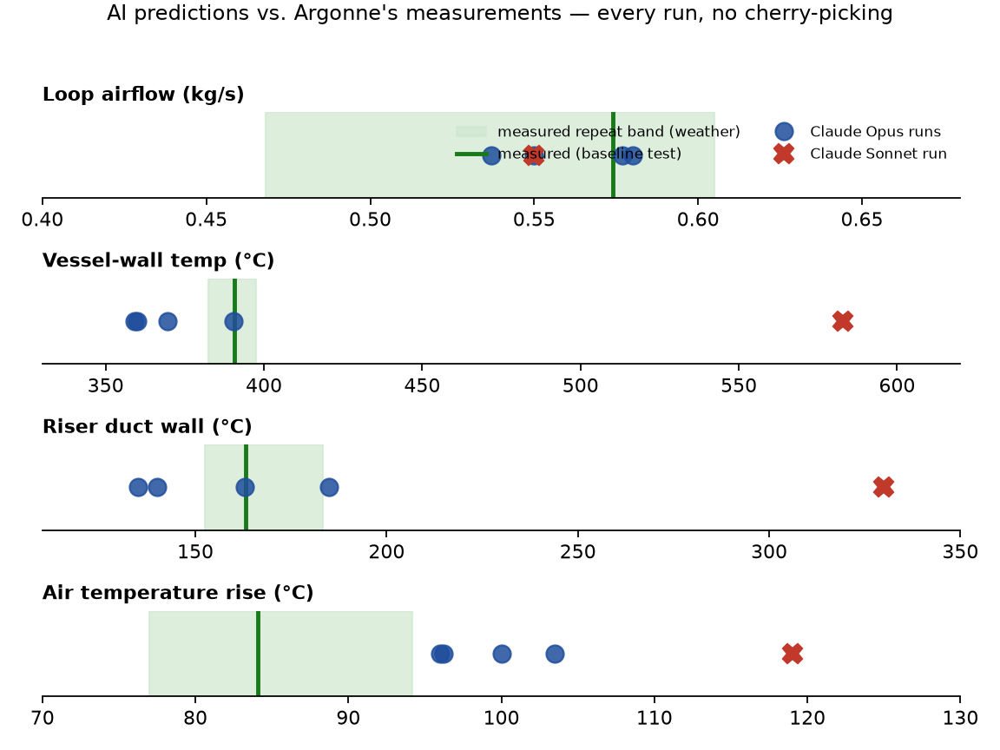
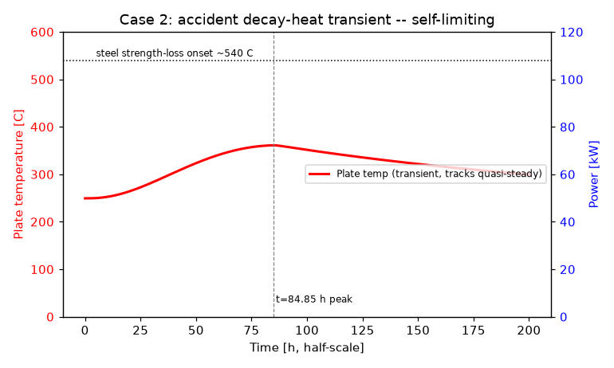
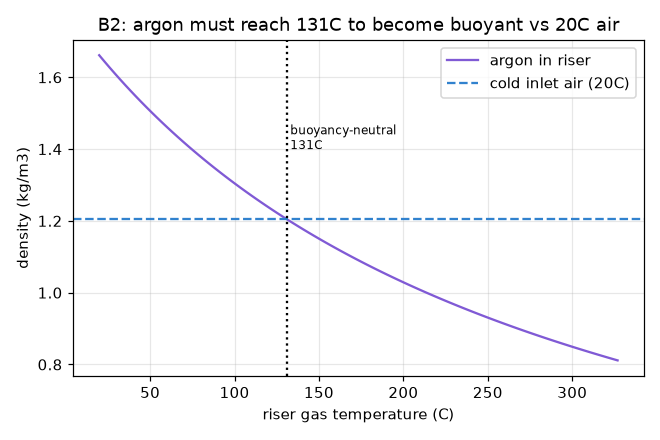

# I gave an AI the blueprints of a nuclear-safety experiment. It predicted the measurements.

**TL;DR.** I gave Claude the geometry, materials, and heater settings of a US national-lab
passive-cooling experiment and asked it — like any engineer — for a calculation note. Working
autonomously on a cheap VPS, it built physics models from textbook first principles and predicted
the lab's measured airflow within ±4% in every run, the vessel-wall temperature within 8%, and
correctly called the accident-transient outcome every time. It also got things wrong in
instructive ways, and an independent adversarial AI audit of my own claims found real issues —
all published. Everything is in the repo, transcripts included.

## The experiment

Modern high-temperature reactor designs claim they can survive a total blackout with a cooling
system that has no pumps and no moving parts: the hot reactor vessel radiates heat across an air
gap to a wall of steel ducts, and the warmed air rises up a chimney on its own. To license that
claim, Argonne National Laboratory built NSTF — a half-scale, 26-metre-tall rig: an electrically
heated steel wall standing in for the vessel (up to 220 kW), twelve steel riser ducts, two
chimneys, ~400 sensors, nuclear-grade QA, 33 months of testing. If you want the physics of *why*
this works (and how the weather gets a vote), that's a companion post.

The point here: this produced years of public, measured truth about a system doing pure physics.
Which makes it a perfect exam for a different question — **can an AI, given only what a design
engineer would have, predict what the lab measured?** Not "can it run a simulation someone set
up." Can it do the engineering: pick the physics that matters, build the model, defend the
assumptions, and land on reality?

## The setup

Each run got a folder and one prompt. The folder: an engineering brief ("produce a calculation
note; I want the airflow, the temperatures, the radiation/convection split, the accident case,
the weather sensitivity"), and four input files — geometry, materials, sensor locations, boundary
conditions. Facts only; no measured results; no method hints. The rules: build from first
principles; install whatever software you want; **do not look up this facility's published
data.**

One disclosure before the results, because it matters: the boundary conditions included the
facility's design duty ("82 kW electric ≈ 56 kW scaled thermal duty") — a normal thing to give an
engineer, but that pairing quietly encodes the rig's measured heater efficiency. The agents'
own loss estimates disagreed with it (they computed 66–72 kW should reach the air); they trusted
the given number. Remember that — it explains their one systematic miss.

I ran this six times over two evenings: four identical baseline runs with Claude Opus (one of
them additionally required to cross-check itself with CFD), one with the facility identity
scrubbed from the inputs, one with a weaker model (Sonnet) — plus a final run on scenarios the
prompt had never mentioned. 13–27 minutes each. About $28 of API, total.

## What came back

Every run independently chose roughly what a good thermal-hydraulics engineer would: a radiation
network across the cavity (hot things glow as T⁴ — that's how ~90% of the heat crosses the gap),
textbook convection correlations for the duct interiors, and a buoyancy-vs-friction loop balance
for the flow — solved in a few hundred lines of Python it wrote from scratch, with cited
correlations (Gnielinski, Churchill–Chu, Sutherland). No CFD mesh needed to get the numbers: the
compute cost of the *physics* is milliseconds. The judgment is the product.

Against Argonne's measurements (their baseline test, 82 kWe):

| Quantity | Measured | Four Opus runs | Verdict |
|---|---|---|---|
| Loop airflow | 0.574 kg/s | 0.55 – 0.58 | **within ±4%, every run** |
| Vessel-wall temperature | 390.7 °C | 359 – 390 °C | −8…0% |
| Riser duct wall | 163.1 °C | 135 – 185 °C | −17…+13% |
| Air temperature rise | 84.1 °C | 96 – 103 °C | **+14…+23% high, every run** |
| Radiation carries the heat? | yes, ~80% | yes, 90–96% | right regime, fraction too high |

Two things to say like an adult. First, the best run landed on 163 °C and 390 °C — within 0.2% of
measurement. That's luck inside a ±5–10% assumption band, not accuracy; judge the ensemble.
Second, the air-ΔT miss is systematic, and it's the supplied heat duty: every run flagged that
exact input as its riskiest assumption *before any comparison existed*. (The facility's own
energy accounting is ambiguous at the ~13% level between two ways of measuring heat-to-air —
the agents' overshoot sits inside that ambiguity, but a miss is a miss.)

The run that had to cross-check itself installed OpenFOAM in Docker, unaided, generated a cavity
case with surface-to-surface view-factor radiation, ran it, and reconciled the CFD's radiative
fluxes with its own hand-built network to within 2% — in 27 minutes, for $8.71. (Scope honesty:
the CFD verified the radiation arithmetic at prescribed temperatures, not the temperatures
themselves.)

## The accident that saves itself

The marquee test at Argonne: drive the wall with a scaled reactor decay-heat curve — 3.5 days of
slowly rising then fading heat — and see if passive cooling keeps up. Measured: the wall climbed
to ~409 °C, flattened, and came back down. The rig saved itself.

*(Figure produced by the agent itself during its run, unprompted.)*

Every single run — even the weak-model one — predicted that outcome, with the right argument:
radiated power grows as temperature to the fourth power, and the chimney draft strengthens with
heat, so every degree of warming buys disproportionately more cooling. Negative feedback
everywhere; nothing to run away. Opus runs put the peak at 359–391 °C (−4 to −12%), classified it
"levels off, no runaway," and stated safety margins. One run even caught that the decay-curve
polynomial I'd supplied was corrupt (a missing coefficient made it diverge), refused it, and used
the stated curve shape instead.

## The blind round

Then I gave one fresh run three scenarios whose measured outcomes I held back, chosen because
they're *weird*:

**Argon flood.** Dump heavy argon gas into the loop's intake. Measured: circulation collapsed to
a dead stop within ~90 seconds, gas temperatures spiked to 126 °C, and the loop restarted itself
about 30 minutes later. Predicted, from scratch: a "density lock" — the heavy cold gas kills the
buoyancy and stalls the loop in seconds-to-tens-of-seconds; the trapped heat then warms the argon
until it becomes buoyant again at a computed threshold of **131 °C**, and the loop purges itself
in minutes. Mechanism, timescales, and a 5 °C hit on the restart temperature — on physics alone.

**Block half the cooling ducts.** Prediction: airflow drops 40% (measured: 37% — good) and the
wall heats up ~100 °C. Measured: it barely rose **13 °C**. Wrong by a factor of eight — and the
agent had pre-registered the exact cause in its confidence notes: it assumed blocked ducts stop
absorbing radiation; in reality they sit there and keep soaking heat. The miss was flagged as a
risk *by the thing that made it*. That's what an honest model looks like.

**Winter vs summer accident.** It correctly ranked which temperatures move with the weather and
which are protected (the vessel wall barely notices — the T⁴ radiation clamps it), though it
under-predicted how much the airflow shifts.

## "It's just in the training data"

The objection everyone should raise. What I found:

- **Asked directly**, from memory, for the measured values of this exact test, Opus, Sonnet, and
  Haiku all refuse: *"I don't reliably remember these specific measured values… any numbers I
  produced would be fabricated."*
- **But they recognize the facility.** Given just the geometry, they name NSTF and Argonne. So
  scrubbing names is cosmetic — which is why I also reran the experiment with a de-identified
  pack. It scored as well as the identified runs (its flow prediction was the best of all: +1%).
- **The transcripts are published.** Every command of every surviving run: zero web searches,
  zero fetches. The agents even wrote their own air-property functions rather than downloading a
  library. The measured data never existed on that machine.
- **The errors are the tell.** Five independent runs missing the same quantity, in the same
  direction, for the same self-stated reason — and a blind-scenario miss whose cause was
  pre-flagged — is the signature of derivation, not retrieval. Memorized answers don't come with
  consistent, explainable mistakes.

Can I *prove* latent memory didn't subtly steer an assumption somewhere? No — nobody can, and
you should distrust anyone who claims to. What I can do is publish everything and let you grep.

## Then I set an AI on my own claims

Before writing this post, I gave a fresh Claude instance — no context, adversarial charter — the
whole repo and told it to tear the claim apart. It ran the agents' model code itself to verify
the numbers weren't hardcoded, grepped the inputs for leaked values, inspected the CFD case, and
came back with: **"supported with corrections"** — plus a list of eight real problems: my
headline oversold the luckiest run, hid the ΔT miss, didn't disclose that the given heat duty
encoded a measured efficiency, and claimed a "transcript audit" without publishing transcripts.

Every correction is applied above, and the audit is in the repo, unedited. If an AI is going to
do engineering, this is the shape I think trust has to take: not "the model is smart," but
*adversarial review plus published evidence, all the way down.*

## What a weaker model does

Same folder, same prompt, Sonnet instead of Opus: it got the loop hydraulics right (flow −4%,
weather trend close) but made one structural mistake in the radiation network — and predicted a
vessel wall of 583 °C, hot by 49%, with the duct wall off by a factor of two. It also took 3×
more turns to finish. Interestingly, it still called the accident "bounded, no runaway" —
the qualitative safety physics is robust even when the numbers aren't. The gap between "sounds
like an engineer" and "lands on the measurement" is exactly the frontier-model edge, and it's
why this project works now and didn't two years ago.

## The bill

Six runs, one with CFD: **$28.53 of API usage, ~13–27 minutes each, on a €30/month VPS.** The
original facility program ran 33 months. The point is not that AI replaces the lab — the lab is
the only reason I can grade any of this. The point is that *verification-grade engineering
analysis* — the months of modeling labor between "here are the drawings" and "here is a defensible
number with an uncertainty budget" — just became something you can rent by the minute.

Hard-tech engineering is labor-bound, not physics-bound. The physics didn't change. The labor
just did.

*Repo with everything — inputs, prompts, all five transcripts, the agents' models, the scoring
against the public Argonne reports, and the adversarial audit: [LINK].*
