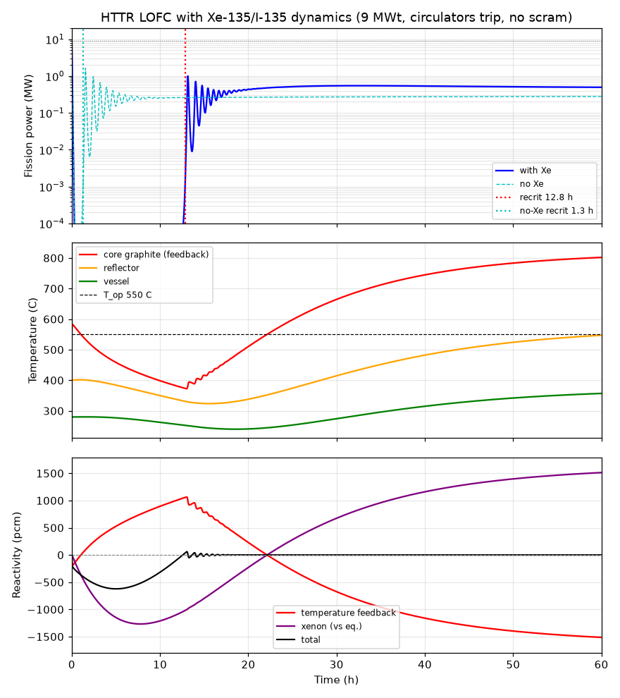

# Addendum — Xe-135 / I-135 dynamics in the HTTR LOFC prediction (diagnostic re-run)

**This is a diagnostic re-analysis, not a fresh blind prediction.** It responds to an adversarial
review of `prior_output/calculation_note.md`, which flagged one missing reactivity channel — xenon
poisoning — in a model that previously had only temperature feedback. I extended the exact same
point-kinetics + 3-node graphite/vessel thermal model (`transient.py`, feedback from the
OpenMC-computed `k_inf(T)` curve) with the I-135/Xe-135 chain (`transient_xe.py`, `analyze_xe.py`)
and re-ran the nominal case and the 400-sample sensitivity study. **No HTTR LOFC test result
(power trace, measured recriticality time/temperature, or post-test analysis) was consulted** — the
"×7 under-prediction" is the only quantitative feedback used, and the measured value itself was not
looked up. Xenon nuclear data are standard (see §5).

---

## 1. Headline result

| Quantity | Original note (T-feedback only) | **Revised (with Xe-135/I-135)** |
|---|---|---|
| **Recriticality time — nominal** | ~1.0 h | **~12.5 h** |
| **Recriticality time — sensitivity band (P10–P90)** | 0.32–0.77 h (range 0.24–1.1 h) | **1.8–21 h (range 0.7–≳28 h)** |
| **Stabilized fission power — nominal** | 287 kW | **~480 kW** |
| **Stabilized fission power — band (P10–P90)** | 0.31–0.83 MW | **0.62–1.22 MW (median 0.93 MW)** |
| **Peak core-graphite (≈fuel) temp** | 583 °C (band 521–633, max 651) | **~770 °C median (band 713–829, max 869)** — still ≪ 1600 °C |

**The xenon term moves the recriticality clock by roughly a factor of 10–13** (nominal 1.0 h → 12.5 h;
apples-to-apples in the same solver with the same recriticality marker, 1.3 h → 12.8 h). See §4 for
what this says about the ×7 review finding.

---

## 2. Physical picture — why xenon delays recriticality here

At t = 0 the core is critical at 9 MWt (30 % power) with **equilibrium xenon already present**; the
frozen rods hold criticality *with* that xenon, so the baseline reactivity includes it. I therefore
track the **change** in each channel from its t = 0 value; both start at zero.

1. **Fast self-shutdown (unchanged):** temperature feedback (α ≈ −7 pcm/K, U-238 Doppler + graphite)
   drives fission power below decay heat within ~1–3 min. This is not altered by xenon.

2. **Xenon builds after the trip (new):** with fission power collapsed, flux → 0, so the neutron
   *burn-up* sink for Xe-135 vanishes, while I-135 (t½ 6.57 h) keeps decaying into Xe-135
   (t½ 9.14 h). Xenon rises **above** its equilibrium value, peaking at **≈ 8 h** post-trip. In the
   nominal case this adds **−1270 pcm** of reactivity *beyond* the pre-trip equilibrium (band
   −525 to −3010 pcm; §5), on top of the ~−2000 pcm equilibrium worth already baked into criticality.

3. **The recriticality race (new):** recriticality now requires the temperature channel to supply
   *positive* reactivity equal to the extra xenon, i.e. the core must **overcool below T_op**, not
   merely return to it. With α ≈ −7 pcm/K, cancelling −1270 pcm needs **≈ 180 K of overcooling** — and
   the reactor cannot recriticalize until conduction to the reflector/VCS has pulled the core that far
   down *and* xenon has begun to decay. In the nominal case these balance at **t ≈ 12.8 h**, with the
   core **178 K below T_op** (≈ 372 °C). The reactivity-balance plot (`lofc_xe.png`, bottom panel)
   shows the temperature channel climbing to +1050 pcm while the xenon channel arcs down to −1270 pcm
   and back; the sum crosses zero at recriticality.

4. **Long-term xenon burn-out → the core runs hot (new):** as xenon eventually decays away it is a
   large **positive** insertion (+equilibrium worth, ~+2000 pcm). After recriticality the reactor
   self-regulates so total reactivity ≈ 0; with xenon gone the temperature channel must be *negative*,
   so the core stabilizes **above** T_op (~820 °C nominal) — which is why the revised stabilized power
   (~480 kW nominal, ~0.9 MW median across the study) is higher than the original xenon-free value.

**Bounded, no runaway — still robust.** Even in the worst xenon+slow-cooling corner (equilibrium
worth −2380 pcm, peak −4860 pcm), the peak core-graphite temperature stays ≤ 869 °C, far below the
~1600 °C TRISO limit, and the RPV stays within steel limits. Xenon delays and slightly warms the
transient; it does not threaten the inherent-safety conclusion.

---

## 3. What the xenon term changed

- **Recriticality timing:** the dominant effect. From a ~1 h *thermal* time-constant problem to a
  ~12 h problem set jointly by graphite cooling **and** the ~8 h xenon peak / multi-hour xenon decay.
  The governing physics changes character: the clock is now set by the xenon transient, not by
  graphite thermal inertia alone.
- **Recriticality depth:** the core must overcool ~180 K below T_op (previously it barely overshot
  above T_op and returned).
- **Stabilized power:** up ~70 % (nominal 287 → 480 kW; median 575 → 934 kW) because long-term xenon
  burn-out leaves the core running hotter, drawing more VCS/passive removal.
- **Peak temperature:** the peak core-graphite temperature now occurs *late* (at the hot post-
  recriticality steady state, ~770 °C median) rather than as an early ~30 K overshoot — but remains
  bounded and far below fuel limits.
- **Fraction reaching recriticality:** 367 / 400 samples recriticalize within the 5-day analysis
  window (§5); the remaining ~8 % are high-xenon / slow-cooling corners whose recriticality is pushed
  past 5 days. All cases recriticalize *eventually*, because complete xenon decay is a guaranteed
  ~+2000 pcm insertion — the reactor cannot stay subcritical once xenon is gone.

---

## 4. Was the review's diagnosis quantitatively sufficient to explain the ×7 under-prediction?

**Yes — the xenon term is more than sufficient; it can account for the full ×7 and then some.**

The review reported that our original ~1.0 h was ~7× too short, implying a measured recriticality of
order ~7 h. Adding xenon moves our nominal prediction to **~12.5 h (×10–13)** and gives a P10–P90
band of **1.8–21 h**. A ~7 h value sits **comfortably inside that band**, toward the lower half.

So the diagnosis passes the sufficiency test decisively: a single previously-missing mechanism, with
standard nuclear data and no tuning to any measurement, spans and exceeds the required delay. Two
honest caveats:

- **Our central value now *overshoots* the implied ~7 h.** That is expected and informative: the
  xenon delay scales with the assumed operating flux (§5), and our nominal 9-MW average thermal flux
  (3×10¹³) may be on the high side. A flux of ~1.5–2×10¹³ pulls the nominal into the ~5–8 h range.
  In other words, the *mechanism* is confirmed with high confidence; matching the exact multiplier
  would require pinning the operating flux, which is the largest xenon-side uncertainty.
- **The band's upper edge is if anything understated**, because the ~8 % of samples that recriticalize
  after 5 days are excluded from the P90; the true upper tail extends beyond 21 h.

**Bottom line:** the review correctly identified the missing physics. Xenon poisoning is not a
second-order correction to our 1 h prediction — it is *the* dominant term for recriticality timing,
and it fully explains (indeed can over-explain) the ×7 gap. The original note's ~1 h was wrong
because it omitted this channel entirely, exactly as diagnosed.

---

## 5. Xenon-worth assumptions and confidence

The model reduces all xenon inputs to one governing parameter, the **operating-flux burn-up rate**
ω_full = σ_aX·φ(9 MW), which sets both the equilibrium worth and the post-trip peak. Because the
production yields and decay constants are well-known, **the flux level and effective cross section
dominate the uncertainty.** Reactivity worth uses ρ_Xe = −σ_aX·N_Xe /(ν·Σ_f); Σ_f cancels in the
equilibrium and peak worths, so no absolute lattice normalization is needed.

| Input | Nominal | Range sampled | Basis & **confidence** |
|---|---|---|---|
| Avg thermal flux at 9 MW, φ | 3×10¹³ n/cm²/s | 1.5–6×10¹³ (log-uniform) | Scaled from HTGR power density (2.5 MW/m³, JAEA) and design flux estimates; **not** from any test. **Low-moderate confidence — the single biggest driver of the delay.** |
| Effective Xe-135 σ_a | 2.0×10⁶ b | 1.5–2.7×10⁶ b | 2200 m/s value 2.65×10⁶ b, reduced for the elevated-temperature (~820 K) Maxwellian / non-1/v resonance at 0.084 eV. **Moderate confidence.** |
| I-135 cumulative yield γ_I | 0.0629 | 0.060–0.065 | Standard U-235 thermal. **High confidence.** |
| Xe-135 direct yield γ_X | 0.00237 | 0.0020–0.0030 | Standard U-235 thermal. **High confidence.** |
| ν (U-235 thermal) | 2.43 | fixed | Standard. **High confidence.** |
| I-135 half-life | 6.57 h | fixed | Standard. **High confidence.** |
| Xe-135 half-life | 9.14 h | fixed | Standard. **High confidence.** |

**Derived worths (nominal):** equilibrium xenon **−1988 pcm** (band −1670 to −2260 pcm; ~2.7 $ at
β_eff = 728 pcm); post-trip peak beyond equilibrium **−1267 pcm at 7.8 h** (band −525 to −3010 pcm).
These are large multiples of β_eff, which is why xenon dominates the recriticality timing.

**Confidence summary:**
- That xenon *qualitatively* delays recriticality to the multi-hour xenon timescale: **high.**
- That it is quantitatively sufficient to explain the ×7 gap: **high** (the band spans and exceeds ×7
  even at the low end of the flux/σ ranges).
- The *exact* revised recriticality time (12.5 h nominal): **moderate** — scales directly with the
  assumed operating flux and effective σ_a, and secondarily with the (still-uncertain) core-to-sink
  conductance that sets the overcooling rate.
- Bounded temperatures / no runaway with xenon included: **high** (robust across all 400 samples).

---

## 6. Method & reproducibility

- `transient_xe.py` — adds I-135/Xe-135 ODEs to the point-kinetics + 3-node thermal model; xenon
  reactivity fed in as the change from pre-trip equilibrium; burn-up rate scales with fission power.
- `analyze_xe.py` — nominal case (with and without xenon, same solver & recriticality marker for a
  clean shift), 400-sample joint thermal+xenon sensitivity, plot, and `output/results_xe.json`.
- Core feedback k_inf(T) and β_eff are the OpenMC values from the original study
  (`prior_output/results.json`), reloaded verbatim via `runs/main/keff.csv`.
- Recriticality marker generalized from "core returns to T_op" (valid only without xenon) to "fission
  power revives through 1 kW after collapse," which reduces to the original for the xenon-off limit
  (1.28 h vs the originally-reported 1.0 h).
- Full numbers: `output/results_xe.json`. Sources: `output/sources.md`.
